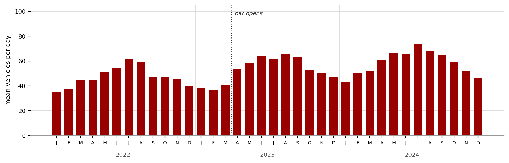

# Practicum: Workflows and Provenance in KNIME

**DSCI 549 — Introduction to Computational Thinking and Data Science**
Week 5· Fall 2026 · In-class activity 

*AI use disclaimer: Claude was used in creating this Practicum!*

Today you will build a real data analysis without writing a single line of code — and then you will look at what your analysis leaves behind as a record of itself. That record is called provenance, and it is the difference between an analysis someone can trust and one they simply have to take your word for.

Nothing here is graded and nothing gets turned in. Work at your own pace, talk to the person next to you, and break things.

## Learning goals

By the end of this session you should be able to:

- Treat a piece of software as a **black box** with defined inputs, outputs, and parameters — without knowing how it works inside.
- Compose several black boxes into a **workflow** that performs a multi-step analysis.
- Explain why the same analysis done in a spreadsheet leaves **no usable record**, while a workflow does.
- Identify what a provenance record must capture beyond the list of operations — in particular, the *reasons* behind each decision.

---

## Before you start

### Install KNIME Analytics Platform

KNIME Analytics Platform is free and open source. It runs on Windows, macOS, and Linux. Install it before class if you can — the download is around 1.5 GB and campus Wi-Fi will not enjoy thirty people doing this at 8:05am.

1. Go to <https://www.knime.com/downloads> and download KNIME Analytics Platform for your operating system. You do not need a KNIME Community Hub account.
2. Run the installer. On macOS you may need to right-click the app and choose **Open** the first time, because it is not from the App Store.
3. Launch it. When asked for a **workspace** location, accept the default. The workspace is just the folder where your workflows will live.
4. Skip or dismiss any welcome tour, example-workflow prompt, or Community Hub sign-in.

### Get the data

We will use the traffic dataset from the course repository. It records the number of vehicles passing through one intersection on every day of 2022, 2023, and 2024 — three full years, 1,096 rows.

Download it from:
<https://raw.githubusercontent.com/msoley/DSCI549/master/In-class%20exercises/Practicum5/traffic_counts_practicum.csv>

Right-click the link and choose **Save Link As…** — do not copy and paste the text out of your browser, because you will silently mangle the line endings. Save it somewhere you can find again, such as your Desktop.

> **If the download will not cooperate.** KNIME can read straight from a web address. In the CSV Reader you will configure in Part 1, change the file-source dropdown from **Local File System** to **Custom/KNIME URL** and paste the link above into the box. Everything else in this handout works the same way.

### A note on versions

KNIME reorganizes its interface between major releases, and a few nodes have been renamed over the years. Menu paths here describe KNIME 5.x. If a menu item is somewhere else in your version, search for the node by name in the node repository — the names are stable even when the menus move. Ask if you get stuck; do not spend ten minutes hunting.

---

## The problem

A bar opened across the street from a residential intersection on **1 April 2023**. It is busy on Friday and Saturday nights.

Residents complain that they cannot find parking on those nights, and they blame the bar.

The bar owners reply that traffic through the neighborhood has been climbing for years anyway, and that this has nothing to do with them.

The city has a traffic counter at the intersection. It has produced one number per day since the start of 2022 — over a year before the bar opened, and nearly two years after. Both parties are now pointing at the same file. Your job is to find out what the file actually says — and, just as importantly, to leave behind a record of *how* you found out.

> **Before you open anything, answer this question.** What would the data have to look like for the residents to be right? What would it have to look like for the bar owners to be right? Be specific about which days you would be looking at, and which stretches of time you would compare.
>
> Do this now, before you see the numbers

---

## Part 1 — One node is one program


In KNIME, every square on the canvas is a node. A node is a small program. It has inputs on its left, outputs on its right, a settings dialog, and a traffic light underneath. You do not need to know how any of them work internally. This is the black box idea from lecture, made literal.

### Create the workflow

1. In the **Space Explorer** panel on the left, right-click your local space and choose **Create Workflow**.
2. Name it `DSCI549_traffic_yourlastname`.
3. Double-click it to open the empty canvas.

### Add your first node

1. Find the **Node Repository** panel and type `CSV Reader` into its search box.
2. Drag **CSV Reader** onto the canvas. Notice the traffic light is **red**: the node exists but has not been told what to do.
3. Double-click the node to open its dialog. Browse to `traffic_counts_practicum.csv`.
4. Look at the preview at the bottom of the dialog before you click anything else. Then click **OK**. The light turns **yellow**: configured, but not yet run.
5. Right-click the node and choose **Execute** (or select it and press F7). The light turns **green**.
6. Right-click again and open the output table (the bottom item in the menu, usually **File Table**). You should have **1,096 rows** — three years of daily counts, one of which was a leap year.

> **Checkpoint 1.** 1,096 rows, two columns. If you have 1,097, KNIME read the header line as data — reopen the dialog and make sure the header option is on.

### Fix the column names

The file has a sloppy header: the date column has no name at all, and the count column is called `0`. KNIME will have invented something like `Column0`. This is extremely normal for real data.

1. Add a **Column Renamer** node (called `Column Rename` in older versions).
2. Connect it: click and drag from the small black triangle on the right edge of **CSV Reader** to the triangle on the left edge of **Column Renamer**. That black arrow is a data table flowing from one program into the next.
3. Configure it: rename the date column to `Date` and the count column to `Vehicles`. Execute.

> **Why this matters later.** You have just performed your first irreversible-looking transformation — and it is not irreversible at all. The original file on disk is untouched. KNIME never edits your source data; it reads it and passes copies downstream. Compare this to opening the CSV in Excel, renaming the headers, and hitting Save.

---

## Part 2 — A workflow is a multi-step program

### Look before you clean

1. Add a **Line Plot** node and connect it to **Column Renamer**.
2. Configure it to plot `Vehicles`. Execute, then open the view.
3. Describe what you see out loud to the person next to you before reading the next paragraph.

Two things should be visible. First, a slow wave that rises and falls three times across the plot — one cycle per year. That is real, and you will have to deal with it later. Second, a scatter of days where the line drops straight to the floor while every other day sits somewhere between 17 and 105.

Zoom in on those floor values, or open the Statistics node output later, and you will find they are of exactly two kinds: **−1** and **0**. Neither is a real vehicle count, but they are not equally obvious, and that difference matters.

**−1 is impossible.** A sensor cannot count a negative car. A value that is not merely unlikely but arithmetically cannot occur is a **sentinel** — a number the equipment writes to mean "no reading," chosen precisely because it can never be confused with real data. Twenty-two days are marked this way.

**0 is only implausible.** A street can, in principle, have a day with no traffic. But the quietest genuine day in three years recorded 17 vehicles, and a jump from 17 straight to 0 on thirty-three scattered days is not how traffic behaves. The likeliest reading is that the logger ran and recorded nothing. You cannot prove that from this file — and that is the point. You are about to make a judgement call, and you should write it down.

### Remove the sentinel values

1. Add a **Row Filter** node after **Column Renamer**.
2. Configure it to **exclude** rows where `Vehicles = -1`. Execute.
3. Check the row count in the output. You should have **1,074** rows — twenty-two were removed.

### Remove the implausible values

1. Add a **second Row Filter** after the first one.
2. Configure it to keep only rows where `Vehicles > 0`. Execute.
3. You should now have **1,041** rows. Thirty-three zero days are gone.

> **A design choice worth arguing about.** Recent KNIME versions let a single Row Filter hold both conditions at once — `Vehicles > 0` on its own would have removed the −1 rows and the 0 rows together, in one step. Your workflow would be one node shorter and the numbers would be identical.
>
> It would also be one node *less honest*. Those two filters are not doing the same kind of work. The first removes values that **cannot** be real and needs no defense. The second removes values that **could** be real and rests on a judgement you made about how traffic behaves. Collapsing them into `> 0` hides the second decision inside the first one's respectability.
>
> One node says "we removed some rows." Two nodes say "we removed a sentinel, and separately, we made a call." How finely you break up a workflow is a provenance decision, not a technical one. Keep two nodes.

### Look again

1. Add a second **Line Plot** after the second filter and execute it.
2. Add a **Statistics** node after the second filter. Execute and open the statistics table. Note the mean — it should be close to **52.9**.
3. Keep the *first* line plot on the canvas. Do not delete it. Being able to see the before and the after side by side, months later, is a large part of the point.

> **Checkpoint 2.** 1,041 rows, mean around 52.9, and a line plot that now looks like plausible daily traffic with a clear annual wave running through it. All node traffic lights green.

---

## Part 3 — Answering the actual question

The residents' claim is about particular *days of the week*; the bar owners' claim is about a *stretch of time*. Both of those are currently locked inside a text column. Get them out first.

Here is the whole workflow you are building, so you can see where each piece goes before you start wiring anything.


> **One output port, many connections.** Three different nodes take their input from the second Row Filter, and two separate branches start from the date-part extractor. An output port is not used up when you connect it — you can drag as many connections out of it as you like, and every one receives the same table. That is how a workflow branches, and it is why you never have to delete the diagnostic plots from Part 2 to make room for new work.

1. Add a **String to Date&Time** node after your second Row Filter. Select the `Date` column, set **New type** to **Date** (not Date&Time — there is no clock time in this file), and set the format to `M/d/yy`. Execute.
2. Add the date-part extractor after it. Depending on your KNIME version this node is called **Date&Time Part Extractor** or **Extract Date&Time Fields** — they are the same node and the dialog is identical. Search the repository for just `extract` or `part`; typing the full name fails in some versions because of the ampersand. In its dialog tick **Year**, **Month (number)**, and **Day of week (name)**. Execute.

> **If the checkboxes are greyed out.** The input column is still text. Look at the column header in the previous node's output: a string column shows a red **S**, a date column shows a calendar icon. If you still see the **S**, the **New type** setting above is the usual culprit.

### 3.1 — The monthly view

Start with the bar owners' claim, because it sounds like the simpler one: has traffic been climbing?

1. Add a **Date&Time to String** node connected to the date-part extractor. Set the format pattern to `yyyy-MM` and name the new column `YearMonth`. Execute — you should see values like `2022-01`, `2022-02`, running to `2024-12`.
2. Add a **GroupBy** node after it. Group by `YearMonth` — that one column only. Aggregate `Vehicles` using **Mean**, and add a second aggregation on the same column using **Count**. Execute; you should get 36 rows.
3. Add a **Sorter** node after the GroupBy. Sort on `YearMonth` ascending. Execute. Do not skip this — see the note below.
4. Add a **Bar Chart** after the Sorter. Set the category column to `YearMonth` and the value column to the mean.
5. Compare your chart to the figure below, and decide what you think it shows before reading on.



The dominant feature is a wave. Traffic peaks every July and August at around 65 and bottoms out every January at around 39 — the quietest month of the year is barely half the busiest. There is also a slow climb across the three years: 47.6, then 52.8, then 58.4.

So the bar owners are telling the truth about the trend. Traffic really has been rising, and it was rising before they opened. What the chart does **not** show is any step at April 2023. The bar's opening is invisible here.

> **Why that extra node was necessary.** Two separate things went wrong without it, and they are worth separating.
>
> **A chart needs one label per bar.** Grouping by `Year` and `Month (number)` gives every row two identifying values and no single name, and the Bar Chart's category dropdown will not offer you a numeric column at all — it accepts text. `yyyy-MM` collapses both into one label the chart can actually use.
>
> **A GroupBy makes no promise about row order.** It is grouping, not sorting, and the two are different operations. Without the Sorter your months arrive scrambled and the chart is unreadable even once it has labels.
>
> The pattern is `yyyy-MM` and not `yyyy-M` for a reason. `YearMonth` is text, and text sorts character by character, so `2022-10` would land between `2022-1` and `2022-2`. The leading zero is what makes an alphabetical sort come out chronological. Sorting month *names* would be worse still: April, August, December, February — wrong in a way that looks deliberate.
>
> Note what just happened to your provenance record. "Build a label as `yyyy-MM`, then sort ascending" is a real decision about how the result is presented, and because it is two nodes on the canvas, it is written down. Had you typed the labels in by hand or dragged the bars into order in a chart tool, it would not be.

### 3.2 — Two things this chart cannot tell you

**It has collapsed the days of the week.** Fridays and Saturdays are two days out of seven. When you average a whole month together, a change confined to those two days gets spread across the other five as though it had happened there too — about **71% of it is averaged away**. Sixteen extra cars on bar nights would show up here as a bump of under five, in a chart whose bars already swing by twenty-six between January and July. It has nowhere to hide precisely because it is small.

**It has mixed up season with time.** This is the subtler problem and it is the one that will bite you. The bar opened on 1 April. If you compare the six months before that to the six months after, you are comparing **October through March** to **April through September** — which is to say, you are comparing winter to summer. Traffic would have gone up over that window if the bar had never been built.

You cannot fix the second problem by ignoring it, and you cannot fix it by adding more data. The before period and the after period simply are not comparable, because the calendar moved at the same time the bar did.

> **The general lesson.** Aggregation destroys variation *within* the groups you collapse. If your question is about a difference within a group, and you aggregate over that group, the answer is gone before you start looking.
>
> And a before/after comparison only means something if everything except the thing you care about held still. Here the season did not hold still. Whenever a before/after window is also a winter/summer window, you are measuring both at once and you cannot tell them apart.

### 3.3 — Keeping season and day type separate

The fix for both problems is the same: stop collapsing. Split the data by day type *and* by season, keep the years separate, and then compare only like with like.

1. Add a **Rule Engine** node and connect its input to the date-part extractor — the same node that already feeds your monthly GroupBy. Drag a second connection out of that output port; the first one stays exactly where it is.
2. Configure it. New column name `DayType`:

   ```
   $Day of week (name)$ IN ("Friday","Saturday") => "Fri-Sat"
   TRUE => "Sun-Thu"
   ```

3. Add a second **Rule Engine** and connect it to the **first Rule Engine's output** — in series, one after the other, not side by side. Each Rule Engine adds one column, and you need both in the same table. New column name `Season`:

   ```
   $Month (number)$ >= 4 AND $Month (number)$ <= 9 => "Apr-Sep"
   TRUE => "Oct-Mar"
   ```

4. Add a **GroupBy** and connect it to the **second** Rule Engine. Group by `Year`, `Season`, and `DayType` — all three. Aggregate `Vehicles` with **Mean** and **Count**. Execute. You should get twelve rows.
5. Add a **Sorter** so you can find things: `Year`, then `Season`, then `DayType`.

> **Do not connect the Rule Engines to your 3.1 GroupBy.** It is the nearest node and it looks like the obvious place to carry on from. It will not work, and the reason matters more than the fix.
>
> That GroupBy has already collapsed 1,041 daily rows into 36 monthly ones. Its output has no day-of-week column, because there is no single day of the week for the month of March. The information did not travel downstream — the aggregation destroyed it, and nothing you attach afterwards can bring it back.
>
> This is the lesson from 3.2 again, arriving as a wiring error instead of a misleading chart. Branch from before the aggregation, never after it.

#### First, measure the confound

Before looking at the bar at all, fill in the four **2022** cells. The bar did not exist in 2022, so whatever you find here is the neighborhood's own behavior.

| 2022 only — no bar yet | Fri-Sat | Sun-Thu | Weekend premium |
|---|---|---|---|
| **Apr-Sep (summer)** | | | |
| **Oct-Mar (winter)** | | | |

The last column is Fri-Sat minus Sun-Thu — how much busier bar nights are than other nights. Compare the two rows.

> **Stop here and look at those two numbers.** The weekend premium is not a constant. It is large in summer and close to nothing in winter, in a year when there was no bar at all. People go out more on warm weekends; that is all this is.
>
> Now reread the tempting comparison from 3.2 — six months before the opening against six months after. It compares a winter weekend premium to a summer one. It would have found a large "bar effect" in 2022, a year before the bar was built.

#### Now measure the bar

Fill in the summer rows for all three years. Same six calendar months every time, so the season is held still and only the years differ.

| Apr-Sep | Fri-Sat | Sun-Thu | Weekend premium |
|---|---|---|---|
| **2022 — before** | | | |
| **2023 — after** | | | |
| **2024 — after** | | | |

Your estimate of the bar's effect is the change in the weekend premium from 2022 to 2023. The 2024 row is a check: if the effect is real and the bar is still open, it should still be there.

> **Why this works.** Anything that affected the whole neighborhood — the summer peak, the year-on-year growth, the weather — moved Fri-Sat and Sun-Thu together, so it cancels when you subtract one from the other. Anything that affected only bar nights does not cancel. Holding the season fixed and then differencing the day types strips out both confounds at once.
>
> You will meet this again in Week 5 under a proper name. You have just built one.

> **Checkpoint 3.** You can state, in one sentence per claim, whether it is supported and which specific comparison establishes that. You can also say roughly how wrong you would have been had you compared the six months before the opening to the six months after.
>
> One loose end worth noticing: your twelve-row table has an `Oct-Mar` row for 2023 that is meaningless, because January to March 2023 is before the bar opened and October to December is after. Your grouping cut straight through the event you are studying. What would you change?

## Part 4 — Provenance: the workflow is the record

*Approximately 20 minutes. This is the part of today that shows up on the midterm.*

Imagine you had done all of this in a spreadsheet. You would have sorted, deleted fifty-five rows, typed a few formulas, and made a chart. The result would be correct. But the file on your disk would show only the **end state** — those rows would simply be absent, with nothing to say they ever existed or why they left.

Your KNIME canvas is different. It is not a picture of the analysis; it is the analysis. Every operation is still there, in order, with its settings, still executable. That is provenance.

### 4.1 — Record the reasons, not just the operations

A node named "Row Filter" tells a reader *what* happened. It does not tell them *why*, and the why is the part that cannot be recovered from the file later.

1. Click on the text label directly underneath your first Row Filter and type a real explanation. Something like: *Drop −1 — sensor's offline sentinel. A count cannot be negative, so nothing real is lost.*
2. Now the harder one. The second Row Filter needs an annotation that admits what it is doing: *Drop 0 — assumed logger error, not a genuinely empty street. Lowest real reading in three years is 17. Not confirmed with the city.*
3. Right-click an empty area of the canvas and add a **workflow annotation** — a colored box you can drag over a group of nodes. Draw one around your two filters and label it **Data cleaning**.
4. Add a second annotation around Part 3 labeled **Analysis**.

> **The honest version.** Notice the difference between those two annotations. The first states a fact. The second states an assumption and labels it as one.
>
> Six months from now, nobody will be able to tell from the data which of your filters was safe and which was a guess — unless you wrote it down. "Not confirmed with the city" is the sentence that saves you when someone eventually checks, and it costs you nothing to type today.

### 4.2 — Record who, when, and what this is

1. Open the workflow **Description** or **Metadata** panel (in KNIME 5.x, the side panel when the workflow is selected in the Space Explorer).
2. Fill in a description: what question this workflow answers, what data it uses, and where that data came from — the full URL, not "the class file."
3. Add your name as author and add tags such as `traffic`, `data-cleaning`.

This is **metadata** — data about your data and your process. We spend all of Week 11 on it. Notice that KNIME gives you fields for it and that nothing forces you to fill them in. Most people do not. This is why most analyses are not reproducible.

### 4.3 — Reproducibility

1. Right-click the workflow and choose **Reset** (reset all nodes). Every light goes yellow and every result is discarded.
2. Now execute the whole workflow again (**Execute All**, or Shift+F7).
3. Confirm you get 1,041 rows and the same mean. You just destroyed and rebuilt an entire analysis in a few seconds, from a record rather than from memory.

### 4.5 — Make it portable

1. Add a **CSV Writer** node at the end of your cleaning branch and write the cleaned table to `traffic_clean.csv`. Execute.
2. Export the workflow: right-click it in the Space Explorer and choose **Export** (in older versions, **File → Export KNIME Workflow…**). Save it as a `.knwf` file.
3. Note the size of the two files you just made. Compare what each one contains.

The CSV contains 1,041 numbers and no history. The `.knwf` contains every node, every setting, every annotation, your metadata, and the graph connecting them — a complete, executable account of how those 1,041 numbers came to be. One of these is a result. The other is a result **plus its justification**.

